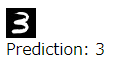

MNIST on browser.

Training model by Tensorflow / converting the model to Tensorflow.js.

Steps
- Setup tensorflow / python environment
- Run `train.py`
- Run `tensorflow-converter` for the generated model.
- Start a HTTP server
- Check the behavior on browser.
